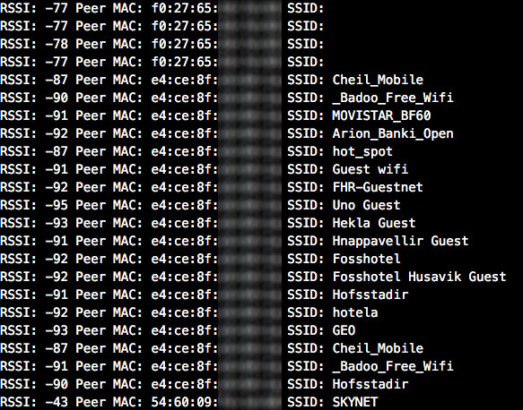

# ESP8266 WifiSniffer

This is only an easy experiment which uses a ESP8266 wifi module to look for near smartphones around you. You can do this very easily with any computer and some software but this is a good way to learn the possibilities of these tiny ESP8266 modules.

**VERY IMPORTANT:** *This code is only for educational purposes. We don’t want to listen for any private communication and we don't do it. All packets that you can listen with this code are public packets without any encryption or secure layer on it, continuously broadcasted to the air by smartphones. Please, check which country's laws applies to you before use this code.*

## Introduction

Some time ago I saw this [video](https://youtu.be/DbqkBAjId_U?t=405) of *Chema Alonso* about how insecure are our mobile phones. He explains, among other things, that your phone is constantly searching for all WiFi networks which you already connect  in the past (unless you did remove as "saved"), saying to anyone who is listening for those public packets where you have been before, and of course, your unique device MAC address.

Those public packets are named as "probe requests" and are used by smartphones to connect faster to wifi networks than if it waits for the network send a Beacon frame to announce the SSID.

This program just listen for those "probe requests" and prints to serial port the information. For now only shows the RSSI (bigger values are near devices), the MAC address of the device and the SSID (if available) of the wifi network which is looking for. Something like that:



## Code  

This repository uses [Platformio](http://platformio.org/platformio-ide) to compile and upload code to ESP8266 but you can also use it with [Arduino IDE](https://github.com/esp8266/Arduino#installing-with-boards-manager).

I use one [nodeMCU devkit](https://github.com/nodemcu/nodemcu-devkit) because is an fast and easy way to program the chip because it includes serial to usb converter and breadboard compatibility but there are [many flavors](http://www.esp8266.com/wiki/doku.php?id=esp8266-module-family) available.


```
extern "C" {
  #include <user_interface.h>
}

#define DATA_LENGTH           112

#define TYPE_MANAGEMENT       0x00
#define TYPE_CONTROL          0x01
#define TYPE_DATA             0x02
#define SUBTYPE_PROBE_REQUEST 0x04


struct RxControl {
 signed rssi:8; // signal intensity of packet
 unsigned rate:4;
 unsigned is_group:1;
 unsigned:1;
 unsigned sig_mode:2; // 0:is 11n packet; 1:is not 11n packet;
 unsigned legacy_length:12; // if not 11n packet, shows length of packet.
 unsigned damatch0:1;
 unsigned damatch1:1;
 unsigned bssidmatch0:1;
 unsigned bssidmatch1:1;
 unsigned MCS:7; // if is 11n packet, shows the modulation and code used (range from 0 to 76)
 unsigned CWB:1; // if is 11n packet, shows if is HT40 packet or not
 unsigned HT_length:16;// if is 11n packet, shows length of packet.
 unsigned Smoothing:1;
 unsigned Not_Sounding:1;
 unsigned:1;
 unsigned Aggregation:1;
 unsigned STBC:2;
 unsigned FEC_CODING:1; // if is 11n packet, shows if is LDPC packet or not.
 unsigned SGI:1;
 unsigned rxend_state:8;
 unsigned ampdu_cnt:8;
 unsigned channel:4; //which channel this packet in.
 unsigned:12;
};

struct SnifferPacket{
    struct RxControl rx_ctrl;
    uint8_t data[DATA_LENGTH];
    uint16_t cnt;
    uint16_t len;
};

static void showMetadata(SnifferPacket *snifferPacket) {

  unsigned int frameControl = ((unsigned int)snifferPacket->data[1] << 8) + snifferPacket->data[0];

  uint8_t version      = (frameControl & 0b0000000000000011) >> 0;
  uint8_t frameType    = (frameControl & 0b0000000000001100) >> 2;
  uint8_t frameSubType = (frameControl & 0b0000000011110000) >> 4;
  uint8_t toDS         = (frameControl & 0b0000000100000000) >> 8;
  uint8_t fromDS       = (frameControl & 0b0000001000000000) >> 9;

  // Only look for probe request packets
  if (frameType != TYPE_MANAGEMENT ||
      frameSubType != SUBTYPE_PROBE_REQUEST)
        return;

  Serial.print("RSSI: ");
  Serial.print(snifferPacket->rx_ctrl.rssi, DEC);

  char addr[] = "00:00:00:00:00:00";
  getMAC(addr, snifferPacket->data, 10);
  Serial.print(" Peer MAC: ");
  Serial.print(addr);

  uint8_t SSID_length = snifferPacket->data[25];
  Serial.print(" SSID: ");
  printDataSpan(26, SSID_length, snifferPacket->data);

  Serial.println();
}

/**
 * Callback for promiscuous mode
 */
static void ICACHE_FLASH_ATTR sniffer_callback(uint8_t *buffer, uint16_t length) {
  struct SnifferPacket *snifferPacket = (struct SnifferPacket*) buffer;
  showMetadata(snifferPacket);
}

static void printDataSpan(uint16_t start, uint16_t size, uint8_t* data) {
  for(uint16_t i = start; i < DATA_LENGTH && i < start+size; i++) {
    Serial.write(data[i]);
  }
}

static void getMAC(char *addr, uint8_t* data, uint16_t offset) {
  sprintf(addr, "%02x:%02x:%02x:%02x:%02x:%02x", data[offset+0], data[offset+1], data[offset+2], data[offset+3], data[offset+4], data[offset+5]);
}

void setup() {
  Serial.begin(115200);
  delay(10);
  wifi_set_opmode(STATION_MODE);
  wifi_set_channel(1);
  wifi_promiscuous_enable(0);
  delay(10);
  wifi_set_promiscuous_rx_cb(sniffer_callback);
  delay(10);
  wifi_promiscuous_enable(1);
	Serial.println("Listening on channel 01");
}

void loop() {}


```

## Useful links

- [Bins that track mobiles banned by City of London Corporation](http://www.telegraph.co.uk/technology/news/10237811/Bins-that-track-mobiles-banned-by-City-of-London-Corporation.html)
- [Where’ve you been? Your smartphone’s Wi-Fi is telling everyone](http://arstechnica.com/information-technology/2014/11/where-have-you-been-your-smartphones-wi-fi-is-telling-everyone/)
- [Passive wifi tracking](http://edwardkeeble.com/2014/02/passive-wifi-tracking/)
- [IEEE 802.11 frame format](http://www.studioreti.it/slide/802-11-Frame_E_C.pdf)
- [esp8266 forum](http://www.esp8266.com/viewtopic.php?f=6&t=1589)
